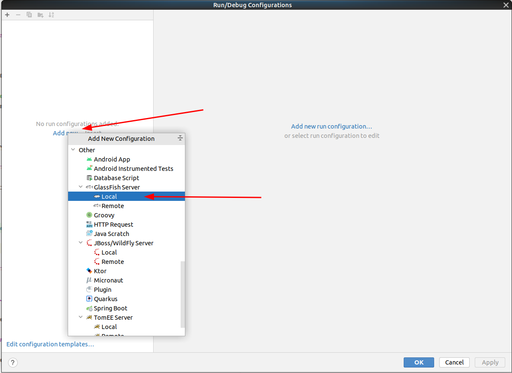
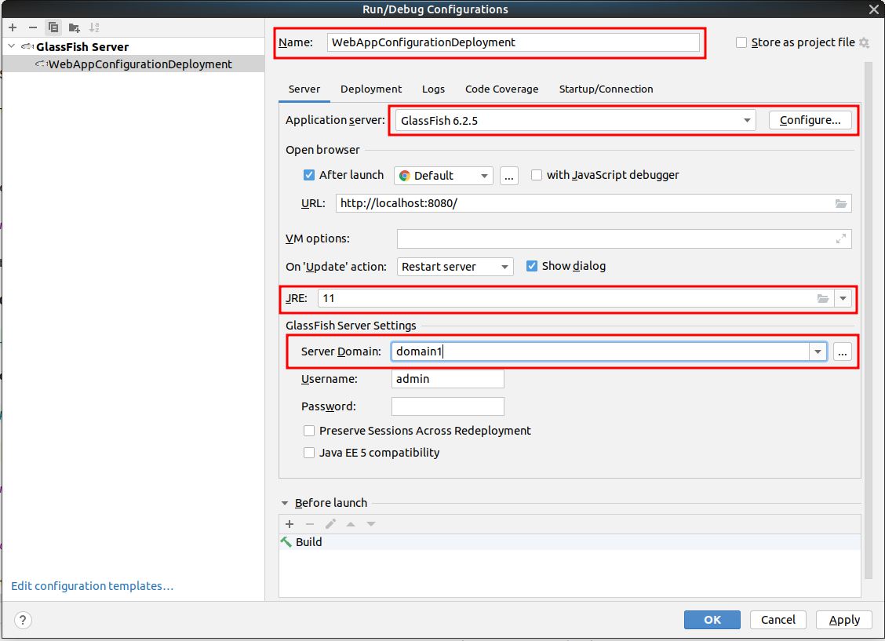
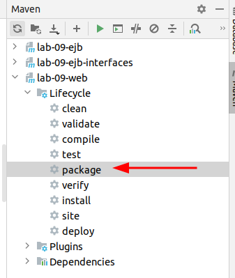
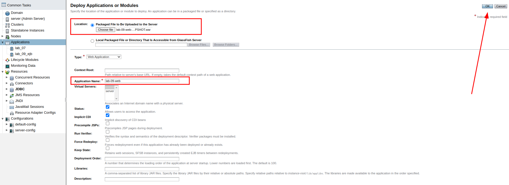
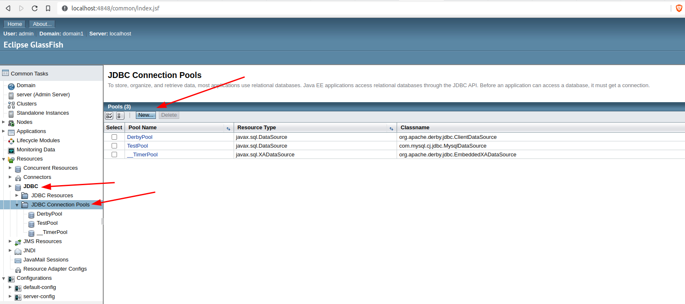
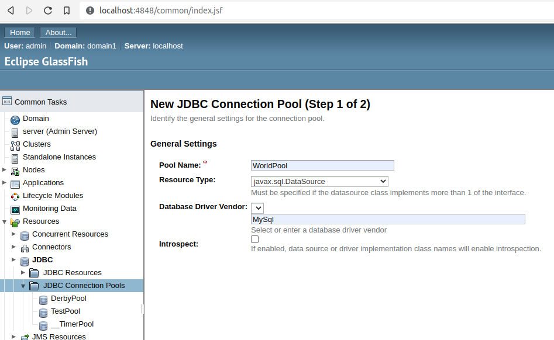
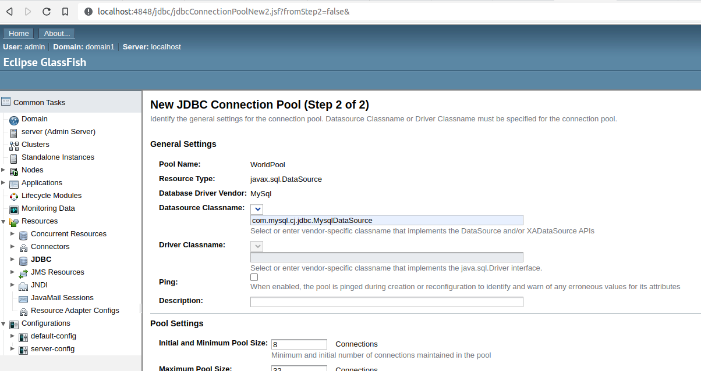
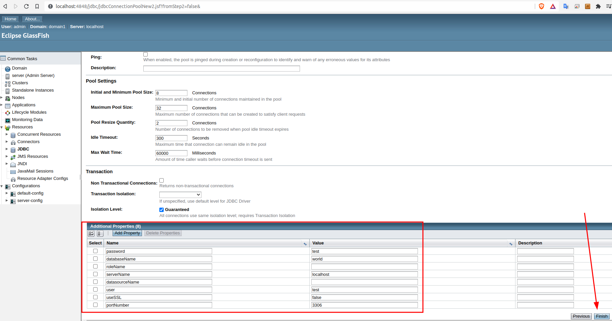
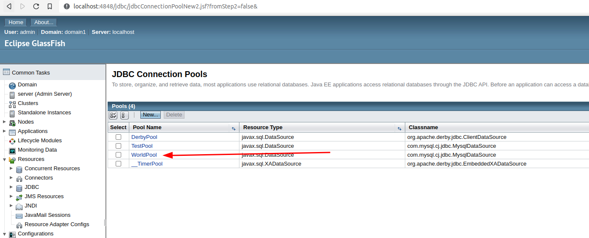

# Hands-on session 8: Glassfish & JDBC Resources

In this session, the next topics are covered:

- Java Enterprise Servers 
- Glassfish Application Server
- Configuring IntelliJ to work with Glassfish
- Deploying our Web Application in Glassfish
- Creating a JDBC Connection Pool
- Creating a JDBC Resource

## Required software

For this session it is required to have installed:

- Java SDK 11. (*)
- Apache Maven 3.x version. (*)
- [Glassfish 6.2.5](https://www.eclipse.org/downloads/download.php?file=/ee4j/glassfish/glassfish-6.2.5.zip) version.
- An IDE (IntelliJ, Eclipse, Netbeans)

Also, do not forget to define the following environment variables:

- `M2_HOME` -> root directory of your Maven installation.
- `JDK_HOME` -> root directory of your JDK installation.
- Update the `PATH` environment variable by adding the `bin` directories of your JDK and Maven installations.

(*) You can avoid doing all these step manually by installing
[SDKMAN](https://sdkman.io/).

## Exercise 01: Running Glassfish

Once you downloaded the zip file of Glassfish 6.2.5 version, uncompress this folder and follow the next steps:

1. Let's call ${GLASSFISH_HOME} the location where my Glassfish is (/home/jose/Software/glassfish-6.2.5/glassfish6)
2. Open a terminal and move to the ${GLASSFISH_HOME}/bin directory. 
3. Run the following: `chmod +x *`
4. In the same location, run the following command: `./as-admin start-domain`
5. Moreover, for stopping it run the following command: `./as-admin stop-domain`

## Exercise 02: Deploying a Web App on Glassfish

There are two ways of deploying a Web Application on Glassfish:

### Deploying a Web Application using IntelliJ Ultimate

For this option, it is required to build a configuration:

1. On the toolbar, click on **Edit Configurations...**

   

2. In the shown popup, click on **Add new** or in the (+) and click on **GlassFish Server -> Local**

   

3. A new configuration window is displayed, and it is required to fill in the following information:
   - Name: Enter a name for your configuration.
   - Application server: Configure and select a Glassfish server.
   - JRE: Choose 11 (in case you don't have it, please install it).
   - Server Domain: domain1, it is the default one.

   

   4. It is time for configuring the artifacts to be deployed in this configuration so click on the **Deployment** tab:

      1. Open the list of artifact available and click in **Artifact...** option.
      
   
      2. In the opened popup select the artifact you want to deploy.
      
   
      3. In the same tab, update the context of your Web Application.
      
   
      4. Go to the **Server** tab, update the options shown in the next image and click on **OK**.
      

5. Finally, run your configuration and a browser will be opened with your Web Application.
   

### Deploying a Web Application using Glassfish Administration Console

As a prerequisite for this, **Glassfish must be running**. 

1. Build the **war** file of your Web Application by running the Maven **package** lifecycle.

2. As a result, a war file is generated into the **target** folder.
3. Open a browser and access to the following URL: **http://localhost:4848**.
4. Go to **Applications** and click in the **Deploy...** button.

5. A new page is loaded and, you have to select your **war** file, edit the **Application name** field and click on OK button.

6. Your Web Application will be displayed in the Applications list. Click on your Web Application.

7. Finally, update the **Context Root** value and click on the OK button.

8. Open a browser and enter the following URL: http://localhost:8080/lab-09-web/

## Exercise 03: Creating a JDBC Resource

Again, we are going to make use of the Glassfish Administration console. Note that for this point, we are going to use a MySQL Database.

1. Make sure Glassfish server is stopped.
2. Download a JDBC driver for your MySQL server version. You can download it from this URL: https://repo1.maven.org/maven2/mysql/mysql-connector-java/
3. Place the **jar** file downloaded in the previous point in the directory **${GLASSFISH_HOME}/glassfish6/glassfish/domains/domain1/lib/**.
4. In the Glassfish Administration page, access to the **JDBC Connection Pools** pages and click **New...**.
      
5. In the next page, enter the following values and click in Next.
   - Pool Name
   - Resource Type
   - Database Driver Vendor
   
6. Another page is loaded to enter more information about the database to connect to. In the next page enter the following values:
   - Datasource Classname: com.mysql.cj.jdbc.MysqlDataSource
      
   - Database Server connection parameters: at the bottom of the same page, enter the following values:
     * password
     * databaseName
     * serverName
     * user
     * useSSL
     * portNumber
     
7. Click on Finish and your JDBC Connection Pool will appear in the JDBC Connection Pools page, click on it.
   
8. In order to ensure that the JDBC Connection Pool was configured properly, click on the Ping button.
   

## Exercise 04: Referring and obtaining a remote reference of an Object.

The solution will be uploaded Nov 8th.